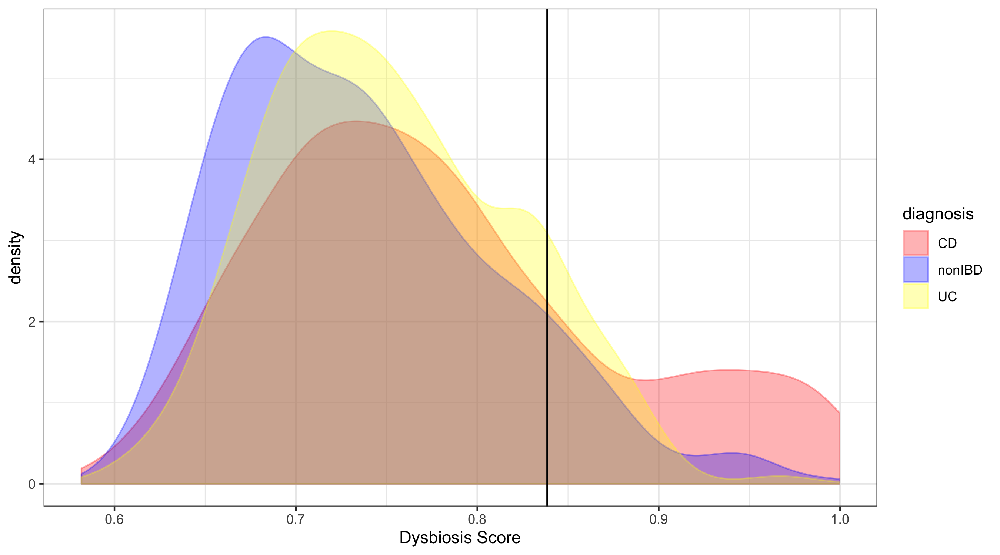

# dysbiosis_Score

 Generates dysbiosis score for HMP2 IBD metagenomics samples.

This code is modified from the HMP2 bitbucket repository  https://bitbucket.org/biobakery/hmp2_analysis/src/default/common/

It attempts to generate figure 2c in the "Multi-omics of the gut microbial ecosystem in inflammatory bowel diseases",(Lloyd-Price et al., https://doi.org/10.1038/s41586-019-1237-9) and calculates the dysbiotic score for patients present in the metagenomics dataset.

Steps needed to generate this score (taken from the paper's description of the dysbiotic score and the code @ bitbucket)

1. Select Metagenomics samples from taxonomic_profiles.tsv.gz that have filter_reads >= 1 M reads
2. Select a reference set of nonIBD patients with week_num >= 20
3. Select taxonomic rank as species level and discard everything without species assigned
4. Noramlize samples to sum of 1
5. Calculate bray-curtis dissimilarity matrix
6. Calculate the activity index as the median Bray–Curtis dissimilarity to this reference sample set, excluding samples that came from the same subject.
7. Calcualte a dysbiosis threshold as the 90th percentile of this score for non-IBD samples.

Here is a plot similar to Fig 2c generated using the code in IBD_HMP2_dysbiosis_score.R

